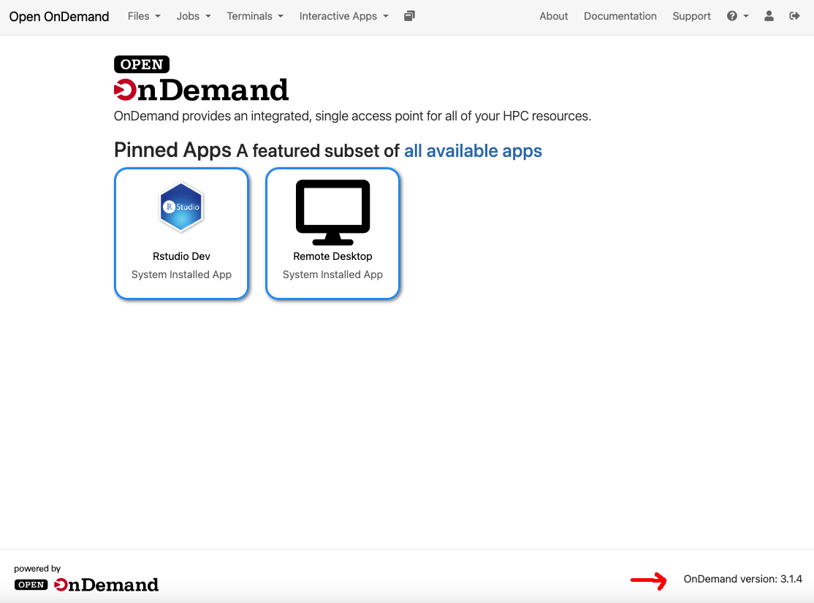

# Rails Passenger Apps Guide

This guide is to help create Open OnDemand Passenger apps in Ruby on Rails. 
With these steps, you will be able to create an application from scratch 
and deploy it in your local environment.

### Rails Sample app

There is a [Rails Sample app](sample_apps/rails_sample) in this repository that you can use as 
a starting point to create your own app.

### Determine the Ruby version available in the Open OnDemand Cluster

- The first step is to determine what is the OnDemand version running in your cluster. You can see that by browsing 
to the home page and looking at the footer:



- Another way to determine the version is by checking the following file in the Open OnDemand node or container:

```bash
cat /opt/ood/VERSION
```

- Assuming that Open OnDemand cluster is running version 3.1.7, we can see the Ruby version on the release notes:
[https://osc.github.io/ood-documentation/latest/release-notes/v3.1-release-notes.html#dependency-updates](https://osc.github.io/ood-documentation/latest/release-notes/v3.1-release-notes.html#dependency-updates). 

Here we can read that the Ruby version is **3.1**

### Determine the latest supported Rails version

According to the Rails Guides Ruby versions section [https://guides.rubyonrails.org/upgrading_ruby_on_rails.html#ruby-versions](https://guides.rubyonrails.org/upgrading_ruby_on_rails.html#ruby-versions), 
the latest Rails version supported by Ruby 3.1 is **Rails 7.2**

### Develop the Rails application for OnDemand

## Install Rbenv

It is recommended to install the same Ruby version in the local environment, in order to develop de Rails application. 
To manage many Rails versions, you can use `rbenv` in the system. To install it, follow the instructions described in 
the documentation [https://github.com/rbenv/rbenv](https://github.com/rbenv/rbenv). It is also recommended to install 
the Ruby Build plugin [https://github.com/rbenv/ruby-build#readme](https://github.com/rbenv/ruby-build#readme). Once 
you have installed `rbenv`, you can install the Ruby version you want.

NOTE: There are other Ruby version managers such as `rvm` or `asdf`. You can use the Ruby version manager you prefer. 
In this guide we are going to describe the steps with `rbenv`.

## Install Ruby

To see the available Ruby minor versions with 3.1 as the mayor version, you can run this command:

```bash
rbenv install -l | grep 3.1
```

The command says that the latest installable minor version for 3.1 is `3.1.5`. Alternatively, you can check the 
released Ruby versions here [https://www.ruby-lang.org/en/downloads/releases/](https://www.ruby-lang.org/en/downloads/releases/).

Let's install the that Ruby version:

```bash
rbenv install 3.1.5
```
NOTE: you may need to install some development libraries in order to compile Ruby in your system.

Once you have Ruby installed, you can set this version as the local or global Ruby in your system, to do the following steps.

```bash
rbenv local 3.1.5
```
or
```bash
rbenv global 3.1.5
```

## Install Ruby on Rails

You can see the available Rails versions here [https://rubygems.org/gems/rails/versions](https://rubygems.org/gems/rails/versions). 
Since the latest version we can use is 7.2, we'll get the latest minor version available at this moment. For this example, 
we are going to install Rails `7.2.2.1` .

```bash
gem install rails -v 7.2.2.1
```

### Generate Rails project

We can create a Rails project from scratch or reuse the [Rails Sample app](sample_apps/rails_sample). To create 
the application from scratch, we can run this command:

```bash
rails _7.2.2.1_ new project_name
```
This command forces the usage of the Rails version we want, in case we had many Rails versions installed under the same Ruby version.

## Home controller

We need to manage the GET requests on the / route. to do this, we can generate a simple controller with one action:

```bash
cd project_name
```
```bash
rails g controller Home index
```

Then, we need to go to `config/routes.rb` file and uncomment and edit the last line with the `root` path to point to 
the controller and action we have just created:

```ruby
Rails.application.routes.draw do
  get "home/index"
  # Define your application routes per the DSL in https://guides.rubyonrails.org/routing.html

  # Reveal health status on /up that returns 200 if the app boots with no exceptions, otherwise 500.
  # Can be used by load balancers and uptime monitors to verify that the app is live.
  get "up" => "rails/health#show", as: :rails_health_check

  # Render dynamic PWA files from app/views/pwa/*
  get "service-worker" => "rails/pwa#service_worker", as: :pwa_service_worker
  get "manifest" => "rails/pwa#manifest", as: :pwa_manifest

  # Defines the root path route ("/")
  root "home#index"
end
```

## Comment conflicting gem

The gem `error_highlight` installed by default was causing issues when the application was deployed as a Passenger app. 
You can comment the gem declaration in the `Gemfile`:

```ruby
#...
group :development do
# Use console on exceptions pages [https://github.com/rails/web-console]
gem "web-console"

# Highlight the fine-grained location where an error occurred [https://github.com/ruby/error_highlight]
#gem "error_highlight", ">= 0.4.0", platforms: [ :ruby ]
end
#...
```

## Precompile assets

The application will be run under OnDemand as production mode, so, we need to generate the assets to make the 
application work in that environment. Do this every time you update the assets:

```bash
rake assets:precompile
```

### Rails Passenger app deployment scripts

It is assumed that you are working with the repository [ondemand_development](https://github.com/hmdc/ondemand_development) to
run Open OnDemand with its plugins and Passenger apps locally. To deploy the 
Passenger app in Open OnDemand, you can add a [Makefile](https://github.com/hmdc/ondemand_development/blob/main/Makefile) 
entry and a `prototype.sh` script in that repository to move the application to 
the right folder and install the gems under the scope of the Rocky 8 Linux OS 
container image used in the production Open OnDemand.

### Makefile entry

```Makefile
build_rails_prototype:
	# BUILD OOD WITH ROCKY8 IMAGE
	cp -R ../ondemand_dev_guide/sample_apps/rails_sample ondemand/apps/ood_prototype
	docker run --rm -v $(WORKING_DIR):/usr/local/app -w /usr/local/app $(SID_BUILDER_IMAGE) ./prototype_build.sh
```

### prototype_build.sh

```bash
#!/bin/bash

OOD_PROTOTYPE_ROOT_URL=${ROOT_URL:-/pun/sys/ood_prototype}

cd ondemand/apps/ood_prototype
bundle config path --local vendor/bundle
echo "Building with PATH=($OOD_PROTOTYPE_ROOT_URL)"
#bundle install
env RAILS_RELATIVE_URL_ROOT="$OOD_PROTOTYPE_ROOT_URL" bin/setup
cd -
```

### docker-compose.yml

It is necessary to add a Volume declaration on the [docker-compose.yml](https://github.com/hmdc/ondemand_development/blob/main/docker-compose.yml),
to install the Passenger app under Open OnDemand.

```yaml
./ondemand/apps/ood_prototype:/var/www/ood/apps/sys/ood_prototype
```
So the `ood` section in the [docker-compose.yml](https://github.com/hmdc/ondemand_development/blob/main/docker-compose.yml) 
looks like this:

```yaml
  ood:
    image: ${SID_OOD_IMAGE}
    hostname: localhost
    container_name: dev_ood
    privileged: true
    cgroup: host
    volumes:
      - /sys/fs/cgroup:/sys/fs/cgroup:rw
      - ./data:/home/ood/ondemand/data
      - ./ondemand/apps/dashboard:/var/www/ood/apps/sys/ood
      - ./config/local/dashboard/.env:/var/www/ood/apps/sys/ood/.env
      - ./config/local/public:/var/www/ood/public
      - ./config/local/ondemand.d:/etc/ood/config/ondemand.d
      - ./config/local/app_overrides:/etc/ood/config/apps/ood
      - ./dev/metrics:/etc/ood/config/plugins/metrics
      - ./dev/session_metrics:/etc/ood/config/plugins/session_metrics
      - ./dev/cluster:/etc/ood/config/plugins/cluster      
      - ./ondemand/apps/ood_prototype:/var/www/ood/apps/sys/ood_prototype      
    ports:
      - "33000:443"
    expose:
      - "6817"
      - "8080"
      - "80"
      - "443"
```

## Deploy the app locally

After setting up the scripts above, just run

```bash
make build_rails_prototype
```

and then start Open OnDemand:

```bash
make start_ood
```

## Add Passenger app on OOD Navigation Menu

You can declare a [manifest.yml](sample_apps/rails_sample/manifest.yml) file inside the Passenger app directory to
make Open OnDemand add it to the Navigation menu.

Our [Sample Rails app](sample_apps/rails_sample) has this [manifest.yml](sample_apps/rails_sample/manifest.yml):

```yaml
---
name: Rails Prototype
description: stuff
icon: fa://hdd-o
category: Files
subcategory: Utilities
```

which means that it will appear under the `Files` dropdown menu with the name `Rails Prototype` and the
specified icon.

Further documentation on **Manifest** files can be found [here](https://osc.github.io/ood-documentation/latest/how-tos/app-development/interactive/manifest.html?highlight=manifest)

# Developing in your local environment

You can develop the application as a standalone Rails app within your IDE. 

- To run the application in development mode execute the following command in the console:

```bash
rails server
```

The application will be served in `localhost:3000`

Alternatively, if you use RubyMine, you can click on the `Play` button in the top-right bar.

## Debugging Rails applications

### Debugging with RubyMine

If you use RubyMine IDE, it contains its own debugging capabilities. To do that, you can place a breakpoint in
the line of code you want to debug:


And then click on the `Debug` button on the top-right bar.

Once you make a request that runs that piece of code, the debugger will stop the execution by showing the 
status of the process.


### IDE-independent debugging

Rails has also IDE-independent debugging capabilities with `debug` and `web-console` gems, included in the 
default Rails 7.2 applications.

- To use `debug`, you need to add the `debug` gem in your Gemfile and then place the `debugger` method in the piece of 
code you want to debug and execute the Rails application. Rails Server will stop the execution in that point and you 
will be able to debug from the terminal, by even invoking `irb` to inspect the variables:


- To use `web-console`, you need to declare that gem in the Gemfile and put `console` in the piece
of code you want to debug. A Rails Console will be open in the web browser, that will allow you to
inspect the variables you want.


Further details can be found on the [Rails Guides](https://guides.rubyonrails.org/v7.2/debugging_rails_applications.html)